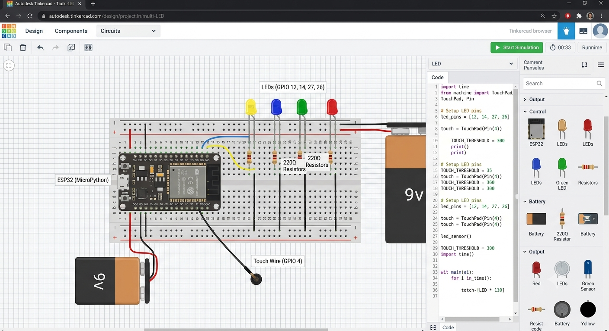

# ESP32 Touch-Controlled LED Pattern Generator

An interactive MicroPython project for the ESP32 that cycles through multiple dynamic LED lighting patterns using a capacitive touch sensor. 

## Features

- **Capacitive Touch Control:** Cycle through modes seamlessly using built-in ESP32 capacitive touch sensing on GPIO 4.
- **4 Custom LED Patterns:**
  - **Pattern 0:** Synchronous All-LED Blink.
  - **Pattern 1:** Forward Chaser / Running Light.
  - **Pattern 2:** Ping-Pong / Bounce Effect.
  - **Pattern 3:** Alternating LED Pairs.
- **Software Debouncing:** Edge-detection state machine prevents accidental double-triggers.
## demonstration 
[Watch the ESP32 LED blinking demo](https://youtu.be/x5k0Y5_Bi6Y)
## Connections

## Hardware Required

- ESP32 Development Board
- 4x LEDs (Any color)
- 4x 220Ω Resistors (Current limiting)
- Conductive Touch Element (e.g., metal strip, wire, or aluminium foil)
- Breadboard & Jumper Wires

## Pinout Mapping

| Component | ESP32 GPIO Pin | Connection Notes |
| :--- | :--- | :--- |
| **LED 1** | GPIO 12 | Anode via 220Ω resistor |
| **LED 2** | GPIO 14 | Anode via 220Ω resistor |
| **LED 3** | GPIO 27 | Anode via 220Ω resistor |
| **LED 4** | GPIO 26 | Anode via 220Ω resistor |
| **Touch Sensor** | GPIO 4 (Touch0) | Bare wire or touch plate |
| **Common Ground**| GND | Cathodes of all LEDs |

## Installation & Setup

1. **Flash MicroPython:** Ensure your ESP32 board is flashed with the latest MicroPython firmware.
2. **Wire the Circuit:** Connect the LEDs and touch pin according to the pinout table above.
3. **Upload Code:** Save the provided script as `main.py` onto your ESP32 using an IDE like **Thonny** or **VS Code (with MicroPico plugin)**.
4. **Calibration (Optional):** If touch responsiveness is off, check your baseline values in the REPL using `touch.read()`. Adjust `TOUCH_THRESHOLD` in the code accordingly:
   ```python
   # Lower value = touched. Standard threshold is 300.
   TOUCH_THRESHOLD = 300
